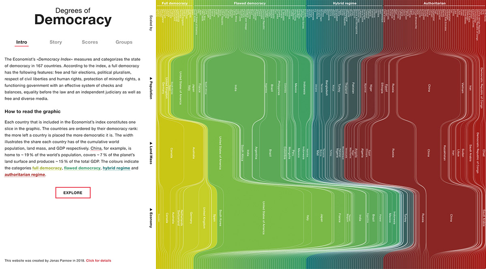

# Degrees of Democracy

[https://democracy.visualising.systems](https://democracy.visualising.systems/)



The project gives a new perspective on the world and the »Democracy Index« by The Economist. Usually, we compare countries on a map. This is reasonable as their geographical position and shape is often a dominant cultural and economic driver. On the other hand, arbitrary shapes are hard to compare, map projections are always trade-offs and the impact of globalisation and digital communication demand post-spacial perspectives. The novel graphical form explores countries as »part of the whole«.

By visualising The Economist’s »Democracy Index« in relation to the population, the land mass and the GDP we gain a new perspective on the distribution. Additionally, the display of other meta indicators helps us understand relations and politics.

## Build Setup

``` bash
# install dependencies
$ npm install # Or yarn install

# serve with hot reload at localhost:3000
$ npm run dev

# build for production and launch server
$ npm run build
$ npm start

# generate static project
$ npm run generate
```
